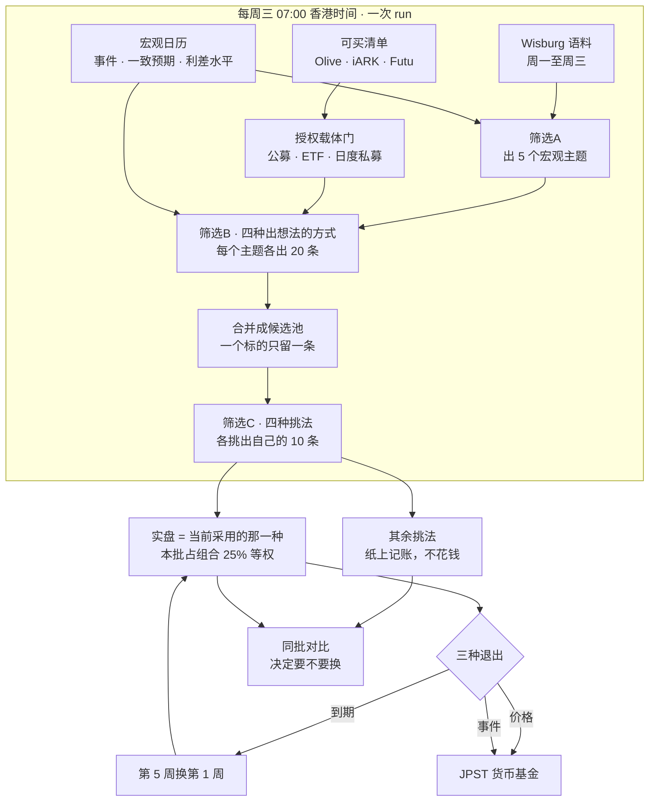
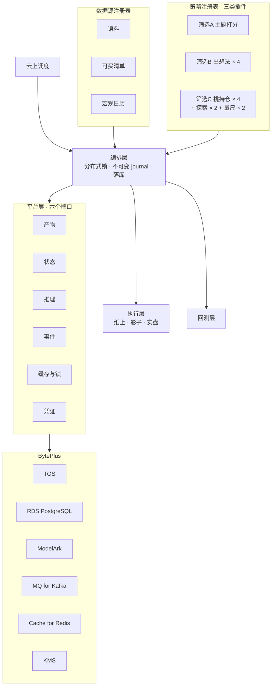

# IdeaGen40

**AI-native、宏观驱动、语义分析主导的动量组合。每周三跑一次，持有期钉死一个月，目标年化 25%。**

不再造一个 quant——相信 AI 的语义分析能读得快、消化快、想到人想不到的点，然后用它做动量。验收线只有一条：**我们自己愿不愿意把钱放进去。**



完整方案见 [`docs/spec_v05.xml`](docs/spec_v05.xml)（飞书同步版含画板）。

---

## 三段筛选

**筛选A · 选主题** —— 读完这一周的语料，选出 5 个值得下注的宏观主题。四个维度：热度要高、分歧要高、实据要硬、已定价要低。主题不是从固定清单里挑的，系统自己从语料里发现新主题，达标就注册；注册日不可回填，所以回放某一周时那周还没出现的主题不会被看到。

**筛选B · 出想法** —— 四种方式同时跑，每个主题各出 20 条一个月期的做多想法：

| # | 方式 | 怎么想 |
|---|---|---|
| 1 | AI 端到端 | 不规定任何推理步骤。整套系统的立论就是相信 AI 的语义分析，**加骨架到底是帮忙还是碍事，只能跟一个没加的比出来** |
| 2 | 约束边界 | 异常 → 真实动机 → 绑住他的约束在哪绷断 → 有日期或有水平的触发条件。约束推出来的封顶是最强形式的「下行有限」 |
| 3 | 传导链 | 强制写出：主题 → 一个能观测有数的中间变量 → 价格通道 → 可买工具，并写明一个月内什么读数会证伪它。链条缺一环就不要 |
| 4 | 共识缺口 | 先说价格已经反映了市场相信什么，只在证据与之矛盾处出想法。**唯一从价格出发而非从叙事出发**的一种 |

四者只在「被要求怎么想」这一点上不同——语料、可买清单、解析、赔率校验、标的核对全部共用同一套代码。否则业绩差可能来自某一种的解析更宽松，而不是这种想法方式更好。

其中 **1 与 2 是预注册的正式比较**，3 与 4 是探索项。哪些比较算正式的必须事先定死：比较次数每多一个，看到假冠军的概率就往上跳一截，看完结果再挑就等于自己给自己发奖。

**筛选C · 定持仓** —— 四种挑法看完全相同的候选池，各挑一份、各记一本账：

| # | 挑法 | 怎么挑 |
|---|---|---|
| 5 | AI 端到端挑 | 直接让模型挑 10 条，每条一句理由 |
| 6 | 按赚亏比排 | 概率加权的赚 ÷ 亏，基准是现金收益——放着不动本来就有 3.4% 年化 |
| 7 | 组合去集中 | 唯一优化「这一组」而不是给单条排名次的。同主题最多 3 条、同敞口 3 条、同一种出想法方式 4 条 |
| 8 | 证据赔率一致性 | 对证据太薄、信心过头、算得粗糙、不对称没来由这四件事扣分 |
| 9 | 不筛全买 | **量尺**。它赢了意味着所有挑法都是白费劲 |
| 10 | 随机抽 | **量尺**。它赢了意味着价值全在准入门槛，排序本身是噪音 |

只有一种花真钱，其余纸上记账、不占资金、不下单。

---

## 数一下

```
5 主题 × 4 种出想法方式 × 20 条 = 400 条原始想法
                                ↓ 只对应 96 个不同标的
                        候选池 96 条（一标一条，赔率取中位数）
                                ↓
            8 本并行账本（4 方法 + 2 常驻探索 + 2 量尺）
```

**实际筛选比是 10 / 96 ≈ 10%，不是 10 / 20 = 50%。** 「每个主题 20 条」说的是筛选B 每个主题的产量；筛选C 面对的是全部主题、全部方式合并去重后的池子。这个差别不是措辞——50% 的筛选比里挑法能起的作用有限，10% 意味着挑法这一层的权重重得多。

四种方式的重叠是实测的：96 个标的里 **17 个是四种都看中的**，33 个三种，35 个两种，只有 11 个是某一种独有。合并时赔率取中位数而非最优——取最优等于把池子交给最激进的那一种，那看起来像本事，其实只是敢喊。

**为什么不做 4×4 全交叉：**

| 设计 | 账本 | 比较次数 | 至少出一个假赢家 |
|---|---|---|---|
| 全交叉 | 16 | 15 | **54%** |
| 合并池（采用） | 8 | 4 | **18.5%** |

只有四种挑法进正式比较，所以比较次数是 4 而不是 8——两个量尺是基准不是候选，两个常驻探索（只看最多亏多少、赚亏比·严门槛）只用来产生想法、不下统计结论。16 本账则意味着一半以上的时间你会看到一个假冠军。而且样本本来就紧：持有 30 天、每周跑一次，窗口重叠让每期只值 **0.23 个独立样本**——配对比较要约 17 次周跑（4 个月）才能分辨 2 个百分点，不配对要 20 个月。

---

## 架构：投资逻辑是插件，系统不是



换一种打法是加一个文件，不是改流水线。`IDEAGEN_PLATFORM=local|byteplus` 切换整套适配器；建表语句与写入路径都可移植，换库只换 DSN。

| 模块 | 做什么 |
|---|---|
| [`ideagen/strategy.py`](ideagen/strategy.py) | 策略注册表。策略声明版本、角色、要不要模型、默认参数。`RunContext` 不带数据库句柄也不带网络——**能查库的策略就是能不小心读到未来的策略** |
| [`ideagen/feeds.py`](ideagen/feeds.py) | 数据源注册表，按种类校验，每行盖上期次与来源。`expect_rows` 声明下限，因为空返回满足所有校验规则，是最危险的一类失败 |
| [`ideagen/orchestrator.py`](ideagen/orchestrator.py) | 一次运行走完三段。需要哪些端口由注册表推导，不由调用方声明 |
| [`ideagen/schema.py`](ideagen/schema.py) | 可移植建表、建表前查撞名、可重复执行的加列、孤儿行检查、凭证审计 |
| [`ideagen/execution.py`](ideagen/execution.py) | 想买什么与怎么下单分开。纸上 / 影子 / 实盘同一接口，**实盘适配器故意不能下单** |
| [`ideagen/backtest.py`](ideagen/backtest.py) | 同一套策略跑历史，越界即报错，**样本不够拒绝给结论** |
| [`ideagen/scheduler.py`](ideagen/scheduler.py) | 每周三跑策略、之间常态盯市。入口幂等，心跳单独写 |

### 四条规则，每条都是被违反过一次才立的

| 规则 | 违反的代价 |
|---|---|
| **产物不可变**，按 `runs/日期/run_id/` 寻址 | 原地替换一个批次曾把 58 个仓位绑到错的标的上，一条想法报出 +377% |
| **as-of 一等公民**，价格钳制到已收盘交易日，注册日不可回填 | 08-08 注册的主题曾能影响 08-07 的回放 |
| **凭证不进产物** | 一条体检信息曾把 Redis 连接串原文写进不可变 journal，口令会永久留存 |
| **跑前体检**，需要哪些端口由注册表推导 | 调用方漏写标志，就会先把语料抓完、主题打完，才发现四个生成器一个都跑不了 |

### 影子通道：纸上到实盘之间的那一档

走纸面账本记账，同时把「如果真下单会是什么委托」完整录下来（券商代码、手数、单型、限价、有效期、预估滑点），一张都不发出去。它已经抓到东西了——**纸面成交 1803.9 股，实盘只能买 1799 整股**，这个零股与整手的差异正是这一档存在的意义。

实盘适配器写成**不能下单**：默认可用的下单通道，等于一个 bug、一次重试、一条无人看管的定时任务就能触发的下单通道。

---

## 现在的状态

### 已验证

| 项 | 实测 |
|---|---|
| 三段全流程 | 跑通。5 主题 → 四种方式各 100 条 → 合并 96 条 → 六种挑法各自出账，14 份产物落不可变存储，落库无孤儿行 |
| 数据源 | 语料 311 条、FRED 水平 5 条、美债拍卖 5 条、可买清单 156 条，全部免 key |
| 授权载体门 | 156 条中 101 条可用；排除 4 条个股、6 条无日度申赎证据的私募、45 条载体待确认 |
| 换库只换 DSN | SQLite 与 PostgreSQL 两种方言实测生成正确语句 |
| 同一期只算一次 | 由数据库唯一索引保证，不只靠锁。失败重试留历史，成功重复被拒 |
| 凭证 | 51 个跟踪文件、254 个工作目录文件、266 个 git 历史 blob，**0 处命中** |
| 测试 | 153 项全过 |

### 阻塞中

- **四种出想法的方式还没有真实产出。** ModelArk 推理需要在控制台创建 ARK API key；AK/SK 只能签 OpenAPI，签不了推理。三段管道已用桩验证过契约，但**没有一条想法是真模型写的**。
- **公开产物里有合作方货架数据。** 产品代码顺着想法的描述与来源流进了公开报告，`.gitignore` 只挡了原始快照没挡派生物。发布已被 [`scripts/check_publish_safety.py`](scripts/check_publish_safety.py) 拦住，怎么脱敏、历史要不要重写需人工决定。
- **整条链还没闭合。** 编排到「各挑法出账」为止，从账目到真正建仓那一步仍需手动触发。

### 已知会让回放不干净的地方

不是 bug，是历史数据本身缺了那一维，所以回放到那些期次时结论要打折看。系统每次都把这些数字报出来，不让它变成口头传说。

- 可买清单没有上架日期（156 条全部未知）。字段已加、以后新入的会盖日期，但存量补不出来
- 标的可计价标记是活的，回放看到的是「今天能不能计价」
- 日历的发布时间用的是抓取时间：七月 CPI 日期是 7 月 1 日、八月中才公布
- 语料深度不可重建：7592 篇里 5836 篇是 08-07 及以后补抓的

---

## 快速开始

```bash
git clone https://github.com/YuesongCai/IdeaGen40.git && cd IdeaGen40
pip install -r requirements.txt
```

凭证放在仓库之外的 `~/.ideagen.env`（chmod 600，不会被提交）。只列变量名：

```
WISBURG_MCP_TOKEN                     语料源
FUTU_HOST / FUTU_PORT                 行情（只用行情上下文，从不打开交易上下文）
ARK_API_KEY                           ModelArk 推理
BYTEPLUS_ACCESS_KEY / _SECRET_KEY     对象存储与云服务
BYTEPLUS_REGION                       区域
```

先体检，全绿再跑：

```bash
python3 -c "from ideagen import cli; cli.main(['platform','--env'])"
```

跑一次周策略：

```bash
python3 -c "from ideagen import cli; cli.main(['weekly'])"
```

只跑机械挑法、不落库：

```bash
python3 -c "from ideagen import cli; cli.main(['weekly','--dry-run','--selectors','omega_loose,spread,calib'])"
```

交接给别的账号之前，一条命令跑完脱敏清单：

```bash
python3 scripts/preflight_handover.py
```

---

## 文档

| 文档 | 内容 |
|---|---|
| [`docs/spec_v05.xml`](docs/spec_v05.xml) | 运行规格总文档：三段筛选、组合、退出、验证、平台、当前状态 |
| [`docs/handover.md`](docs/handover.md) | 脱敏与换账号交接手册 |
| [`deploy/agentkit_sandbox.md`](deploy/agentkit_sandbox.md) | 云上沙箱部署 |
| [`tests/test_core.py`](tests/test_core.py) | 153 项测试。每个测试的名字说的是**它防住了什么** |

---

## 免责

纸上交易与研究系统，不是投资建议。持仓与业绩数字来自模拟账本。实盘通道故意没有接通。
