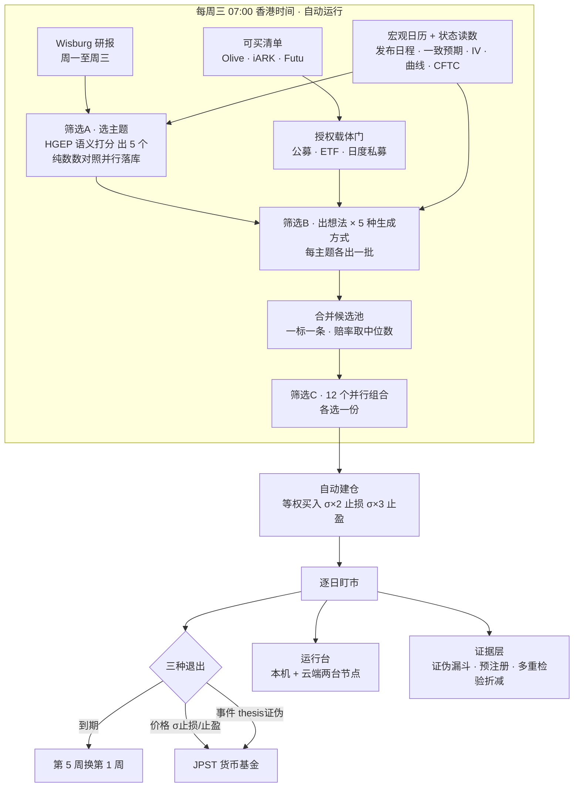
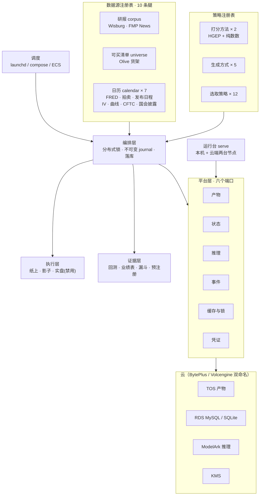

# IdeaGen40

**AI-native、宏观驱动、语义分析主导的动量组合。每周三跑一次，持有期钉死一个月，目标年化 25%。**

不再造一个 quant——相信 AI 的语义分析能读得快、消化快、想到人想不到的点，然后用它做动量。验收线只有一条：**我们自己愿不愿意把钱放进去。**

**看结果 → [运行台快照](https://yuesongcai.github.io/IdeaGen40/)**（每个工作日自动刷新，无需登录）：本期持有什么、10 个组合在赛马、一条候选发现被九道检验减到剩什么、钱押在哪几个宏观判断上。

> 现在能说的结论只有一句：**没有任何一种选取策略被判定获胜。**
> 这个仓库的大部分代码是为了让这句话可信——而不是为了让它变成另一句。



---

## 三段筛选

**筛选A · 选主题** —— 读完这一周的研报，选出 5 个值得下注的宏观主题。四个维度：热度要高、分歧要高、实据要硬、已定价要低。主题不是从固定清单里挑的，系统自己从研报里发现新主题，达标就注册；注册日不可回填，回放某周时那周还没出现的主题不可见。**「纯数数」对照打分每周并行落库**（零模型成本）——「语义打分是否胜过纯提及计数」是被检验的假设，不是前提。

**筛选B · 出想法** —— 五种生成方式同时跑，每个主题各出一批一个月期的做多想法：

| # | 方式 | 怎么想 | 状态 |
|---|---|---|---|
| 1 | AI 端到端 | 不规定任何推理步骤。**加骨架到底是帮忙还是碍事，只能跟一个没加的比出来** | 正式比较 |
| 2 | 约束边界 | 异常 → 真实动机 → 绑住他的约束在哪绷断 → 有日期或有水平的触发条件 | 正式比较 |
| 3 | 传导链 | 主题 → 可观测中间变量 → 价格通道 → 可买工具，并写明一个月内什么读数证伪它 | 探索 |
| 4 | 共识缺口 | 先说价格已反映了什么，只在证据与之矛盾处出想法。**唯一从价格出发**的一种 | 探索 |
| 5 | 穿透反查 | 模型说出公司名，**43,071 行 ETF 持仓数据决定买哪只**——语义归语义，映射归数据 | 09-05 注册，尚未进过周跑 |

五者只在「被要求怎么想」上不同——研报、清单、解析、赔率校验全部共用同一套代码。1 与 2 以 `primary` 注册为正式比较，其余是探索项——探索类只认注册之后的期次。

**第六种是人写的**：`ideagen philosophy` 把 PM 的一句话蒸馏成准则卡，派生出一种新的生成方式，与原方式**一字不改地并跑**。准则记录只增不改。

**筛选C · 定持仓** —— 十二个选取策略看完全相同的候选池，各选一份、各管一个组合（$10m 等资本、等权、进场即挂 σ×2 止损 / σ×3 止盈、滚动持有一个月）：

| 类别 | 组合 |
|---|---|
| 正式比较（primary） | AI 端到端选取 · 赔率排序·宽松 · 分散度约束 · 证据一致性 |
| 探索（exploratory） | 期望值排序 · 下行风险优先 · 赔率排序·严格 |
| 按生成方式（对照） | 只买 AI 端到端产的 · 只买约束边界产的 |
| 量尺（对照） | 不筛全买 · 随机抽 · 一月动量 |

只有一种花真钱，其余纸上记账。量尺赢了 = 筛选没价值；随机赢了 = 价值全在准入门槛。

**净值之差只可能来自「挑得不一样」**：十二个组合共用一个 `RunContext` 和一个 `inputs_sha`，共同的行情涨跌在配对比较里被抵消掉。

---

## 数一下（最近一期 2026-09-02 的实际产量）

```
5 个主题 × 4 种在跑的生成方式 → 254 条原始想法
                             → 73 条候选池（一标一条，赔率取中位数）
                             → 10 个组合各自建仓，共 221 个纸面持仓
```

**实际筛选比 ≈ 10%，不是 50%。** 生成方式之间的重叠是实测的：73 条里 61 条被两种以上方式同时看中。合并时赔率取中位数而非最优——取最优等于把池子交给最激进的方式。

**为什么不做 5×12 全交叉**：比较次数一多，至少一个假赢家的概率就压不住。样本本来就紧：持有 30 天、每周跑，窗口重叠让每期只值 **0.23 个独立样本**——配对比较约 17 次周跑（4 个月）才能分辨 2 个百分点。**回测层在样本不足时拒绝宣布赢家**，而且区分「样本还不够」和「样本已经够了但没检出优势」——那是两句不同的话。

---

## 证据层：一条候选发现，九道检验，减到最后剩什么

这一页只有一条候选发现：**「期望值分数能把候选排出次序」**。下面每一行减掉它的一种解释，并给出那一层的数与判定。**没有一道是干净通过的。**

| 减掉哪一层 | 这一层的数 | 判定 |
|---|---|---|
| *起点*：这个分数能把候选排出次序 | 每期切五分位，Q5 +3.13% vs Q1 +0.67%；两端之差 **+2.68%/期**，区间 [+1.70, +3.75] **不含 0**——这条阶梯是真的 | 看起来成立 |
| 减去「它只是在排风险」 | 按住入场前 60 日波动后，秩相关从 +0.231 掉到偏相关 **+0.005**（t=0.04，区间 [−0.175, +0.218] 盖住 0） | 没扛住 |
| 减去「它只是把商品排在国库券之上」 | 整张货架 +0.231；四个风险家族**内部**最高只剩 **+0.076**（商品），股票 +0.075，债/现金 −0.055 | 没扛住 |
| 减去「优势压在少数几个标的上」 | 剔除本期最常持有的 10 只后 +1.50% vs 全量基准 +1.23% | 没扛住 |
| 减去「只做多能拿到的那部分」 | 顶格减末位是**多空**统计量，其中只有 **64%** 落在多头一侧，而这个授权不做空 | 打折 |
| 减去「成交拿不到的那部分」 | 回测按收盘无条件成交；实跑里唯一挂进场区间的组合 383 张成交 119 张（**31%**）。区间会挑（+1.36pp），但只有成交的钱在场（组合层面 **−0.90pp**） | 打折 |
| 减去「盘子大了以后的成本」 | 同一常数在任何规模下都改不了排名；按流动性分档，$10M 上换 2 个名次、$50M 换 7、$100M 换 **10/11** | 打折 |
| 减去「窗口没跑满的那些仓位」 | 只有 **36%** 的仓位真持满 30 天，而均值把 2 天和 30 天等权混在一起；只看满窗，对全量基准的领先从 +2.36pp 收到 **+1.22pp** | 打折 |
| 减去「一共试了多少次」 | 一共 **14 次**试验（表上 11 个组合，另有 3 次不在表上）。14 次毫无能力的尝试，光靠运气最好那次的年化夏普期望也有 +2.23——门槛不是 0。折减后 **DSR 0.707 < 0.95** | 没扛住 |
| 减去「挑组合这个动作本身」 | 每期只用此前成绩挑领先者 +0.59%/期 vs 随机挑一条 +1.00%；5 次决策的区间 [−2.10%, +1.61%] **盖住 0** | 分不开 |

**剩下能说的**：值得往前跑一段看看。上面每一道检验都是在**同一段样本内**做的——样本内没扛住的东西，样本外不会自己好起来。

### 预注册：什么算它真的成立

「往前跑一段看看」只有在「什么算活下来」被提前写死时才有意义。下一轮真正的自由度不在门槛上，而在「**用哪个数**」——所以估计量用**路径**钉死，不是文字描述。`ideagen/prereg.py` 只增不改，`tests/test_prereg.py` 在某条指向回测不产出的字段时直接失败。

| 要往前检验的那句话 | 估计量（路径） | 门槛 | 样本内 | 进度 |
|---|---|---|---|---|
| 期望值分数在按住入场前波动之后，仍然能排出次序 | `ranking_power.partial_vs_volatility.mean_rho_partial` | ≥ 0.05 | 0.005 | 1 / 8 期 |
| 它在同一个风险家族内部也能排出次序 | `ranking_power.within_family.families.股票.mean_rho` | ≥ 0.05 | 0.075 | 1 / 8 期 |
| 「按此前成绩挑组合」这个动作，胜过随机挑一条 | `tearsheet.walk_forward.no_posthoc.edge_vs_all_arms` | ≥ 0 | −0.41% | 1 / 8 期 |

到期之前**只报数不判定**。原始分位阶梯不作数：它是真的，但它由风险构成——要往前检验的是控住波动之后那个数。

### 七宗罪：常驻的镜子

对照 Deutsche Bank《Seven Sins of Quantitative Investing》逐条自检，每条只写三件事：论文说的失效机制、本仓现在有的那个数、**还不能说的那句话**。全文见 [`docs/七宗罪_逐条对照与已落地的证据.md`](docs/七宗罪_逐条对照与已落地的证据.md)。

| 罪 | 本仓的现状 | 还不能说 |
|---|---|---|
| ① 幸存者偏差 | 新增侧有 `first_seen_d` + `eligible(as_of=)`；删除侧有 `shelf_departures` 快照差分。但**货架快照只有 1 张** | 不能说历史期用的是当期货架——**它就是今天这张** |
| ② 前视偏差 | as-of 钳制五条（研报/行情/日历/候选池/可选标的），`backtest.Audit` 逐条报。补上第五条后 2026-07-29 期的可选标的从 306 收到 133 | 不能说补跑期没有前视：权重没见过未来，但**人的后见之明**是同一回事 |
| ③ 讲故事 | 生成器本身是产故事的机器，解药只能是主动证伪：控波动、剔头部、换 universe | 全部证据落在**同一个上涨 regime** 里 |
| ④ 数据挖掘 | DSR / BH / Bonferroni / PBO；**试验记录 14 条**，注册了组合却没记进记录会让测试变红；同一套规则换四个风险家族原样跑 | 还没有真正的留出集 |
| ⑤ 信号衰减与成本 | `fill_reality`（成交率 31%）+ `cost_sensitivity`（三档成本 × 本金倍数） | 没有冲击成本模型——没人拟合过系数 |
| ⑥ 超额相对谁 | SPY 与**货架等权**（SHELF_EW）并列报：SPY 回答的是别的问题，「选得比不选好」的对照是这张货架。冠军 `ev_rank` 对 SPY +0.47pp、对货架 +1.29pp，但单位波动收益对两者分别是 −0.046 / −0.130——**跑赢是靠多冒的波动，对自己的货架更差** | 货架等权只含今天仍在架上的名字，本身带幸存者偏差——方向已知，它是一条偏严的对照 |
| ⑦ 分位价差 | 顶格减末位拆成多空两半，只报这个授权拿得到的那半 | — |

---

## 架构：投资逻辑是插件，系统不是



| 模块 | 做什么 |
|---|---|
| [`ideagen/strategy.py`](ideagen/strategy.py) | 策略注册表。声明版本、角色、要不要模型。`RunContext` 无库无网——**能查库的策略就是能读到未来的策略** |
| [`ideagen/feeds.py`](ideagen/feeds.py) | 数据源插件，按种类校验，每行盖期次。`expect_rows` 下限——空返回是最危险的失败 |
| [`ideagen/orchestrator.py`](ideagen/orchestrator.py) | 一次运行走完三段；没有研报算失败，不算安静 |
| [`ideagen/periods.py`](ideagen/periods.py) | 期次是全站坐标。名义窗口 ≠ 持有窗口，两者不许混用 |
| [`ideagen/universe.py`](ideagen/universe.py) | 可选标的的授权载体门 + `eligible(as_of=)`。同一个库同一期，读错列会跑出 220 或 86 |
| [`ideagen/macro.py`](ideagen/macro.py) | 宏观状态：日历一致预期 · 隐含波动率 · 曲线 · CFTC 持仓 · 国会披露 |
| [`ideagen/lookthrough.py`](ideagen/lookthrough.py) | ETF 穿透：标签撒谎在哪、主题该买哪只、一组持仓真实押在什么上 |
| [`ideagen/booking.py`](ideagen/booking.py) | 周跑结论 → 每个组合纸面建仓，σ 止损止盈钉死，两级幂等 |
| [`ideagen/execution.py`](ideagen/execution.py) | 纸上 / 影子 / 实盘同一接口，**实盘适配器故意不能下单** |
| [`ideagen/backtest.py`](ideagen/backtest.py) | 同一套策略跑历史，越界即报错，样本不够拒绝结论 |
| [`ideagen/perf.py`](ideagen/perf.py) | 机构口径业绩表：夏普带置信区间、回归 beta、回撤表、DSR / FDR / PBO、成本 × 规模敏感性 |
| [`ideagen/prereg.py`](ideagen/prereg.py) / [`trials.py`](ideagen/trials.py) | 预注册（只增不改）与试验记录（14 条，含 3 条不在比较表上的） |
| [`ideagen/scheduler.py`](ideagen/scheduler.py) | 幂等 tick：周三自动周跑+建仓，其间盯市+心跳；错过的周期记永久缺失不回填 |
| [`ideagen/accounts.py`](ideagen/accounts.py) / [`authpages.py`](ideagen/authpages.py) | 账号体系：scrypt 散列、签名 cookie、改口令 / 增删用户 / 踢设备 / 部署状态 |
| [`ideagen/lexicon.py`](ideagen/lexicon.py) / [`philosophy.py`](ideagen/philosophy.py) | 主题词典与注册；PM 一句话 → 准则卡 → 派生生成方式 |
| [`ideagen/schema.py`](ideagen/schema.py) | 可移植建表（SQLite / MySQL）、撞名前置检查、孤儿行检查、凭证审计 |

### 铁律，每条都是被违反过一次才立的

| 规则 | 违反的代价 |
|---|---|
| **产物不可变**，按 `runs/日期/run_id/` 寻址 | 原地替换批次曾把 58 个仓位绑错标的，一条想法报出 +377% |
| **as-of 一等公民**，注册日/上架日不可回填 | 08-08 注册的主题曾影响 08-07 的回放；回放的可选标的从来没按期过滤过——门在，读的那一列不在 |
| **凭证不进产物**，连接串与桶名服务端脱敏 | 一条体检信息曾把 Redis 连接串写进不可变 journal |
| **「全部组合」必须真的是全部** | 盯市名单漏掉一族组合，114 张单挂两个交易日无人推进 |
| **同一期只算一次**，由数据库唯一索引保证 | 锁能失效，索引不会 |
| **空数据 ≠ 安静**，feed 断连如实报错、没有研报算失败 | 数据源不通和「本周没料」曾长得一模一样；厂商限流曾被读成「那天没研报」 |
| **写库不吞旧值**，空 body/summary 不得覆盖已深抓的 | 浅层重摄取曾抹掉 442/654 篇归档研报正文 |
| **失败不许返回一个合理的值** | 本仓最常见的缺陷形状：读不到写成没有、缺一个数就印一个「通过」的判定 |
| **一个数只能由它数的那张表数出来** | 三处「前视风险两项 / 四层归因 / 四个因子」，数字与紧随其后的清单来自两套分类 |
| **界面上的词说「这是什么」，不说「它怎么存的」** | 「账本 / 臂 / 语料」三个实现比喻漏到界面上；[`tests/test_glossary.py`](tests/test_glossary.py) 现在拦着 |

---

## 运行台

**五个 tab，每个回答一个问题**：概览「这是什么」· 各期「一期一期地看」· 持仓「现在拿着什么」· 方法「怎么选出来的」· 证据「它管用吗」。规则定为 **tab = 一类内容，抽屉 = 某一个具体对象的详情**——之前两个 tab 装不下这个产品，内容只能塞进 13 个抽屉，同一个目的地长出多个入口和多个名字。

概览只回答进门三问，不做浓缩结论；判定和支撑它的证据都待在「证据」页，先看漏斗（这条发现被减到剩什么），再看发现本身。方法页是一张流水线画布，悬停出白话速览、点击拉开决策现场抽屉（最多两层玻璃、类型化面包屑）。任一主题/想法都可以「问当时的它」——只用当期封存材料作答、`[Mn]` 逐条引用。

- 本机：`http://localhost:8765/`（`ideagen serve`）
- 云端：`/login` 真登录页 · `/account` 改口令与设备 · `/deploy` 部署状态
- 公开快照：<https://yuesongcai.github.io/IdeaGen40/>（发布前过脱敏闸门）
- 持牌产品名默认脱敏（`IDEAGEN_DASH_SHOW_LICENSED_NAMES=false`）

---

## 云端：两台节点，push 就是部署

两台角色不同：**生产节点**跑 compose + updater，自己跑周跑；**展示节点**不跑周更，只每 15 分钟拉一次状态快照。分叉的危险不在于数据旧，而在于**页面看起来完全正常**——它照样有净值、有持仓、有回测，只是停在部署那晚。

```
本机 launchd（scheduler / daily / serve / cloudsync）
   │
   ├─ 代码腿  local main 领先 origin/main → 对 HEAD 的干净导出跑全量测试
   │                                    → push → 重新 fetch 确认 origin/main 就是 HEAD
   │
   └─ 数据腿  内容指纹（最新盯市 / 最新运行 / 行数）变了才发布
                                        → tos: deploy/state/<时间>-<sha12>.db

云端 ECS（1 vCPU）
   ├─ updater 每 120s 盯 origin/main → 构建镜像 → 在新镜像里跑测试 → 过了才 tag :live
   └─ systemd timer 每 15 分钟拉状态快照 → 停容器 → 换库 → 起容器
```

- **改代码 = push**，不用登机器；SSH 三条通道全断（本机 Clash TUN 切了所有 22 和 ssh:443、Cloud Assistant 在这个镜像上装不上），剩下的路是 cloud-init。
- **配置不在任何一条腿上**。`runtime.env` 与引导脚本只在开机时写一次，改它要 `StopInstance → ReplaceSystemVolume → StartInstance`。updater 的健康输出里 `syncs` / `does_not_sync` 显式写了这条边界。
- **两条腿共用一把锁**：换库要停容器，换代码要重建容器，交错执行会把旧容器盖在换了一半的库上。
- **代码腿必须有测试闸门**：好几个会话都能推 main，中间没有人。构建先用临时 tag，过了测试才 `docker tag` 成 `:live`。
- **同步失败必须出声**：两条腿都曾在同一个早上安静地错——页面照常有净值、有持仓、有回测，只是停在部署那晚。所以 `sync_to_cloud.py` 的职责不只是推，是**验证推到了**。

```bash
python3 scripts/sync_to_cloud.py --status   # 上次两条腿各干了什么
python3 scripts/sync_to_cloud.py --dry-run  # 只决策，不动手
```

---

## 当前状态（2026-09-06）

| 项 | 实况 |
|---|---|
| 生产环 | launchd 幂等 tick 常驻；周三 07:00 HKT 自动周跑+建仓；心跳判活（30 分钟无心跳=停） |
| 真实周期 | **6 期**（2026-07-29 起），其中 **1 期实跑**（08-26）、5 期事后补跑。补跑的一律标 `backfill`，面板标题挂徽章 |
| 纸面持仓 | 10 个组合共 **610 个未平持仓**、812 个累计持仓，逐日计价 |
| 风控实弹 | σ×2 止损真实触发 **3 次**，σ×3 止盈 **14 次**，到期滚出 185 次 |
| 注册的策略 | 打分方法 2 · 生成方式 5（4 种在跑）· 选取策略 12（本期 10 个建仓）· 回测 11 条 · 试验记录 14 次 |
| 数据腿 | 10 条：研报 2（其一默认关闭）、可买清单 1、日历 7。最近一期读入 **858 篇**研报；ETF 穿透库 43,071 行 / 89 次抓取 |
| 货架 | Olive 快照 151 只（2026-09-05）；`instruments` 306 只，228 只已定上架日、78 只未定 |
| 测试 | **788 项全过**（外加 300 项子测试）。每个测试的名字说的是**它防住了什么** |
| 基准 | SPY 与**货架等权**并列。区间只有 27 个交易日，所以**不给年化**——按 252/27 复利外推得到的是外推假象 |
| 追问 | 任一主题/想法可「问当时的它」——只用当期封存材料作答、`[Mn]` 逐条引用；证据 doc_ids 随打分冻结 |
| 凭证 | 不进产物，连接串与桶名服务端脱敏；`.env.example` 敏感字段全空。发布快照前过脱敏闸门（`check_publish_safety`），`tests/test_export_redaction.py` 拦着 |
| 错过的周期 | 只统计**真的还缺**的期（当前 1 期：2026-07-22）；补上的自动出列 |
| **结论** | **没有。** 9 道检验里 4 道没扛住、4 道打折、1 道分不开；冠军 `ev_rank` 的 DSR 0.707 未过 0.95；PBO 0.67。回测层拒绝宣布任何选取策略获胜 |
| 诚实边界 | ①模型权重见过该日期之后的世界，代码消不掉；②货架只有 1 张快照，历史期用的就是今天这张；③只有 36% 的仓位跑满 30 天；④全部证据落在同一个上涨 regime 里 |

---

## 快速开始

```bash
git clone https://github.com/YuesongCai/IdeaGen40.git && cd IdeaGen40
pip install -r requirements.txt
cp .env.example ~/.ideagen.env && chmod 600 ~/.ideagen.env   # 填空，永不入库
```

```bash
python3 -m ideagen.cli platform          # 六端口体检，全绿再跑
python3 -m ideagen.cli weekly --trade    # 一次周跑 + 自动建仓
python3 -m ideagen.cli serve             # 运行台 http://localhost:8765
python3 -m ideagen.scheduler tick        # 一次幂等调度 tick（cron/launchd 挂这个）
python3 scripts/run_real_backtest.py     # 真实候选池 + 真实收盘的配对扫描，零模型调用
```

无真实凭证也能看全流程：`IDEAGEN_POC_WEEKLY_MODE=public-synthetic` 用合成数据走完整管道。

交接前一条命令跑完脱敏清单：`python3 scripts/preflight_handover.py`

---

## 文档

| 文档 | 内容 |
|---|---|
| [`docs/七宗罪_逐条对照与已落地的证据.md`](docs/七宗罪_逐条对照与已落地的证据.md) | 常驻的镜子：七条失效机制，各自对应的那个数 |
| [`docs/回测设计_如何回测才能服务于25%目标.md`](docs/回测设计_如何回测才能服务于25%目标.md) | 这台仪器能测动什么：统计功效与估计量 |
| [`docs/回测业绩层_机构口径的业绩记录.md`](docs/回测业绩层_机构口径的业绩记录.md) | 测出来之后怎么报：quant / HF / MF 三边口径合并清单 |
| [`docs/词表.md`](docs/词表.md) | 面板上每个词到底指什么，以及哪些词故意没改 |
| [`docs/宏观日历与持仓数据腿.md`](docs/宏观日历与持仓数据腿.md) | 第五到第九条数据腿：日历、IV、曲线、CFTC、国会披露 |
| [`docs/FMP_LOOKTHROUGH.md`](docs/FMP_LOOKTHROUGH.md) | ETF 穿透：标签在哪撒谎、ISIN 作主键 |
| [`docs/期次坐标_设计提案.md`](docs/期次坐标_设计提案.md) | 期是全站坐标；名义窗口 ≠ 持有窗口 |
| [`docs/spec_v05.xml`](docs/spec_v05.xml) | 运行规格总文档（飞书同步版含画板） |
| [`docs/handover.md`](docs/handover.md) / [`docs/ACCOUNTS.md`](docs/ACCOUNTS.md) | 脱敏与换账号交接手册；账号体系 |
| [`deploy/RUNBOOK_ecs_dashboard.md`](deploy/RUNBOOK_ecs_dashboard.md) | ECS + compose + Caddy + 自更新部署 |
| [`tests/`](tests/) | 788 项。每个测试的名字说的是**它防住了什么** |

---

## 免责

纸上交易与研究系统，不是投资建议。持仓与业绩数字来自模拟组合。实盘通道故意没有接通。
