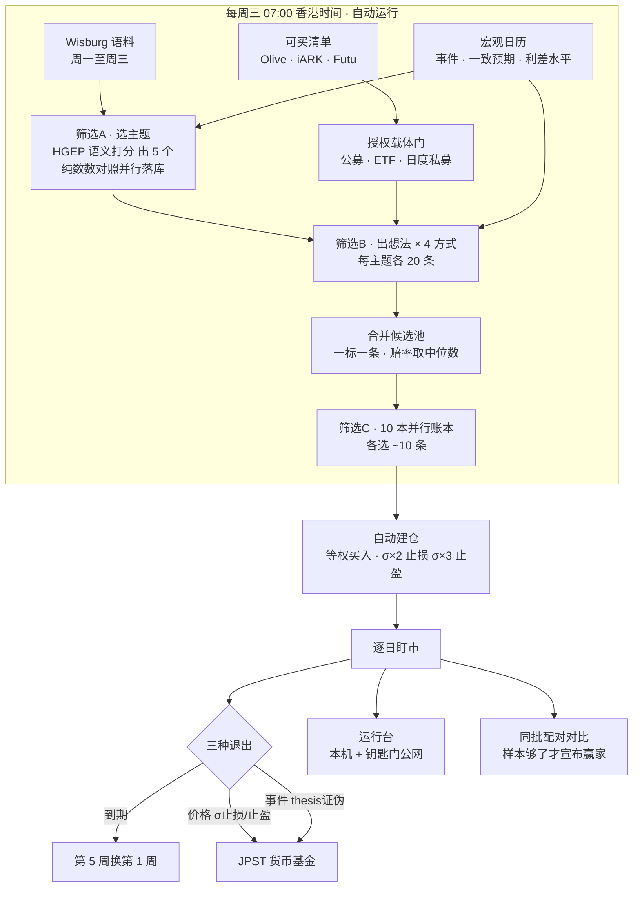
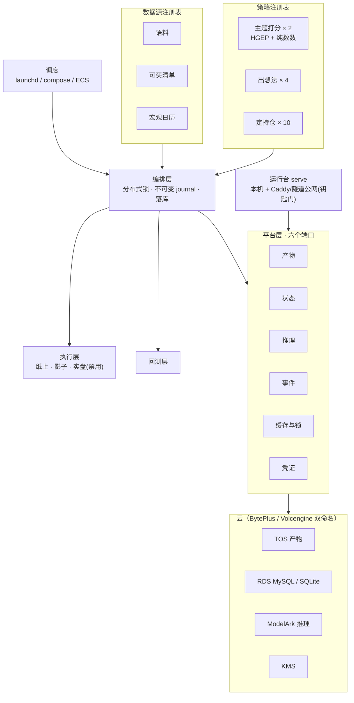

# IdeaGen40

**AI-native、宏观驱动、语义分析主导的动量组合。每周三跑一次，持有期钉死一个月，目标年化 25%。**

不再造一个 quant——相信 AI 的语义分析能读得快、消化快、想到人想不到的点，然后用它做动量。验收线只有一条：**我们自己愿不愿意把钱放进去。**

**看结果 → [运行台快照](https://yuesongcai.github.io/IdeaGen40/)**（每个工作日自动刷新，无需登录）：本期持有什么、10 种挑法在赛马、真实回测的胜率、钱押在哪几个宏观判断上。



---

## 三段筛选

**筛选A · 选主题** —— 读完这一周的语料，选出 5 个值得下注的宏观主题。四个维度：热度要高、分歧要高、实据要硬、已定价要低。主题不是从固定清单里挑的，系统自己从语料里发现新主题，达标就注册；注册日不可回填，回放某周时那周还没出现的主题不可见。**「纯数数」对照臂每周并行落库**（零模型成本）——「语义打分是否胜过纯提及计数」是被检验的假设，不是前提。

**筛选B · 出想法** —— 四种方式同时跑，每个主题各出 20 条一个月期的做多想法：

| # | 方式 | 怎么想 |
|---|---|---|
| 1 | AI 端到端 | 不规定任何推理步骤。**加骨架到底是帮忙还是碍事，只能跟一个没加的比出来** |
| 2 | 约束边界 | 异常 → 真实动机 → 绑住他的约束在哪绷断 → 有日期或有水平的触发条件 |
| 3 | 传导链 | 主题 → 可观测中间变量 → 价格通道 → 可买工具，并写明一个月内什么读数证伪它 |
| 4 | 共识缺口 | 先说价格已反映了什么，只在证据与之矛盾处出想法。**唯一从价格出发**的一种 |

四者只在「被要求怎么想」上不同——语料、清单、解析、赔率校验全部共用同一套代码。1 与 2 预注册为正式比较，3 与 4 是探索项。

**筛选C · 定持仓** —— 十本账本看完全相同的候选池，各选一份、各记一本：

| 类别 | 账本 |
|---|---|
| 四种挑法（正式比较） | AI 端到端挑 · 按赚亏比排 · 组合去集中 · 证据赔率一致性 |
| 按生成方式（观察生成器） | 只买 AI 端到端产的 · 只买约束边界产的 |
| 常驻探索 | 只看最多亏多少 · 赚亏比严门槛 |
| 量尺 | 不筛全买 · 随机抽 |

只有一种花真钱，其余纸上记账。量尺赢了 = 筛选没价值；随机赢了 = 价值全在准入门槛。

---

## 数一下

```
5 主题 × 4 方式 × 20 条 = 400 条原始想法 → 合并成 ~100 条候选池（一标一条）
                        → 10 本并行账本，其中 4 本进正式比较
```

**实际筛选比 ≈ 10%，不是 50%。** 四种方式的重叠是实测的：约六分之一的标的四种方式都看中。合并时赔率取中位数而非最优——取最优等于把池子交给最激进的方式。

**为什么不做 4×4 全交叉**：16 本账 15 次比较 → 至少一个假赢家 54%；现在 4 次正式比较 → 18.5%。样本本来就紧：持有 30 天、每周跑，窗口重叠让每期只值 **0.23 个独立样本**——配对比较约 17 次周跑（4 个月）才能分辨 2 个百分点。**回测层在样本不足时拒绝宣布赢家。**

---

## 架构：投资逻辑是插件，系统不是



| 模块 | 做什么 |
|---|---|
| [`ideagen/strategy.py`](ideagen/strategy.py) | 策略注册表。声明版本、角色、要不要模型。`RunContext` 无库无网——**能查库的策略就是能读到未来的策略** |
| [`ideagen/feeds.py`](ideagen/feeds.py) | 数据源插件，按种类校验，每行盖期次。`expect_rows` 下限——空返回是最危险的失败 |
| [`ideagen/orchestrator.py`](ideagen/orchestrator.py) | 一次运行走完三段；空语料算失败，不算安静 |
| [`ideagen/poc_workflow.py`](ideagen/poc_workflow.py) | 周跑五种数据模式：public-synthetic → shelf-fixture → olive-live → olive-auto → wisburg-auto，演示到生产同一条管道 |
| [`ideagen/schema.py`](ideagen/schema.py) | 可移植建表（SQLite / MySQL）、撞名前置检查、孤儿行检查、凭证审计 |
| [`ideagen/booking.py`](ideagen/booking.py) | 周跑结论 → 每账本纸面建仓，σ 止损止盈钉死，两级幂等 |
| [`ideagen/execution.py`](ideagen/execution.py) | 纸上 / 影子 / 实盘同一接口，**实盘适配器故意不能下单** |
| [`ideagen/backtest.py`](ideagen/backtest.py) | 同一套策略跑历史，越界即报错，样本不够拒绝结论 |
| [`ideagen/scheduler.py`](ideagen/scheduler.py) | 幂等 tick：周三自动周跑+建仓，其间盯市+心跳；错过的周期记永久缺失不回填 |
| [`ideagen/cloud_corpus.py`](ideagen/cloud_corpus.py) / [`shelf_store.py`](ideagen/shelf_store.py) | 授权语料摄入私有云、货架存储 |
| [`ideagen/olive_web.py`](ideagen/olive_web.py) | Olive OAuth/SSO 与网页视图 |

### 铁律，每条都是被违反过一次才立的

| 规则 | 违反的代价 |
|---|---|
| **产物不可变**，按 `runs/日期/run_id/` 寻址 | 原地替换批次曾把 58 个仓位绑错标的，一条想法报出 +377% |
| **as-of 一等公民**，注册日/上架日不可回填 | 08-08 注册的主题曾影响 08-07 的回放 |
| **凭证不进产物**，连接串与桶名服务端脱敏 | 一条体检信息曾把 Redis 连接串写进不可变 journal |
| **「全部账本」必须真的是全部** | 盯市名单漏掉一族账本，114 张单挂两个交易日无人推进 |
| **同一期只算一次**，由数据库唯一索引保证 | 锁能失效，索引不会 |
| **空数据 ≠ 安静**，feed 断连如实报错、空语料算失败 | 数据源不通和「本周没料」曾长得一模一样 |
| **写库不吞旧值**，空 body/summary 不得覆盖已深抓的 | 浅层重摄取曾抹掉 442/654 篇归档研报正文（已从内容寻址归档全量找回） |

---

## 运行台

**两个页面,其余全是抽屉**：本周（结论）与过程（推导）。首屏一条可点的推理链（读研报 N 篇 → 选主题 → 写想法 → 合并候选 → 各账自挑 → 现在持有）；主卡是**噪音带图**——样本不足时「分不出高下」本身就是画面，谁走出 ±2pp 预注册噪音带谁自己亮起来。过程页是一张流水线画布，悬停出白话速览、点击拉开决策现场抽屉（最多两层玻璃、类型化面包屑、深度圆点）；运行日志（真实时钟、逐步耗时、产物清单）是从周历与回执都能拉开的同一个抽屉。审计内容（周历/假设登记/修复账/名词表）挂在它审计的数字旁边，不再单独占页。多实例部署时可设 `IDEAGEN_WEEKLY_ROLE=observer` 声明观察节点：只盯市与展示，周产由生产实例承担，不再每周制造假失败。

- 本机：`http://localhost:8765/`（`ideagen serve`）
- 公网：Caddy（ECS，见 [`deploy/RUNBOOK_ecs_dashboard.md`](deploy/RUNBOOK_ecs_dashboard.md)）或 cloudflared 隧道，均走**访问钥匙门**（`IDEAGEN_DASH_KEY`，本机免钥匙）
- 持牌产品名默认脱敏（`IDEAGEN_DASH_SHOW_LICENSED_NAMES=false`）

---

## 当前状态（2026-09-04）

| 项 | 实况 |
|---|---|
| 生产环 | launchd 幂等 tick 常驻；周三 07:00 HKT 自动周跑+建仓；心跳判活 |
| 真实周期 | 2026-08-26 起。GLM-5.2 真模型出想法，8 本账 **111 个纸面持仓**逐日计价（注册挑法 10 种,本期 8 本入账） |
| 风控实弹 | σ×2 止损已真实触发 **3 次**（3 个已平仓全部为 stop 退出） |
| 测试 | **247 项全过** |
| 胜率与基准 | 每本账+合计报**胜率**（Jon 门槛 >50%，平局算输，样本 <5 单不上色）；合计旁挂**同期只买 SPY** 参照 |
| 追问 | 任一主题/想法可「问当时的它」——只用当期封存材料作答、[Mn] 逐条引用；证据 doc_ids 自 09-03 起随打分冻结；观察节点可经 `IDEAGEN_ASK_UPSTREAM` 转发生产实例 |
| 凭证 | 全库扫描 0 命中；`.env.example` 敏感字段全空 |
| 错过的周期 | 缺口只统计**真的还缺**的期；补上的自动出列。已补的期一律标 `backfill`，面板标题挂「事后补跑」徽章 |
| 产量 | 筛选B 每主题满 20 条（此前模型一次只给 4–11 条，候选池缩水到设计的 1/4）；主题层并发，一期 20 分钟内跑完 |
| 结论 | **没有**。有效独立样本远低于门槛，回测层拒绝宣布任何挑法获胜 |
| 真实回测 | **已跑通并出数**：5 个周期、2849 条持仓、`allow_model=False` 全程 0 次模型调用。`scripts/run_real_backtest.py` 用真实候选池 + 真实收盘做 C 阶段配对扫描，`allow_model=False` 全程零模型调用（可逐字节复算）。首屏一张「历史回测」卡直接给窗口、live/backfill 拆分、各挑法胜率与完整披露 |
| 下结论的门槛 | 判定一种挑法赢了对照，必须**样本量够**且**统计显著**两个条件同时成立。只满足前者的情形有独立措辞（「样本已够检出 2%/周期的差距，但没有检出」），因为那是「没看出优势」而不是「还看不出来」。当前：**没有任何一种挑法被判定获胜** |
| 补跑的诚实边界 | 两处代码消不掉的前视风险，写在披露里而不是脚注：①模型权重见过该日期之后的世界；②货架上 156 个标的没有上架日期，按当期资格过滤时只能放行 |

---

## 快速开始

```bash
git clone https://github.com/YuesongCai/IdeaGen40.git && cd IdeaGen40
pip install -r requirements.txt
cp .env.example ~/.ideagen.env && chmod 600 ~/.ideagen.env   # 填空，永不入库
```

```bash
python3 -m ideagen.cli platform          # 六端口体检，全绿再跑
python3 -m ideagen.cli weekly --trade    # 一次周跑 + 自动建仓
python3 -m ideagen.cli serve             # 运行台 http://localhost:8765
python3 -m ideagen.scheduler tick        # 一次幂等调度 tick（cron/launchd 挂这个）
```

无真实凭证也能看全流程：`IDEAGEN_POC_WEEKLY_MODE=public-synthetic` 用合成数据走完整管道。

交接前一条命令跑完脱敏清单：`python3 scripts/preflight_handover.py`

---

## 文档

| 文档 | 内容 |
|---|---|
| [`docs/spec_v05.xml`](docs/spec_v05.xml) | 运行规格总文档（飞书同步版含画板） |
| [`docs/handover.md`](docs/handover.md) | 脱敏与换账号交接手册 |
| [`deploy/RUNBOOK_ecs_dashboard.md`](deploy/RUNBOOK_ecs_dashboard.md) | ECS + compose + Caddy 部署 |
| [`deploy/agentkit_sandbox.md`](deploy/agentkit_sandbox.md) | 云沙箱部署 |
| [`tests/`](tests/) | 224 项。每个测试的名字说的是**它防住了什么** |

---

## 免责

纸上交易与研究系统，不是投资建议。持仓与业绩数字来自模拟账本。实盘通道故意没有接通。
